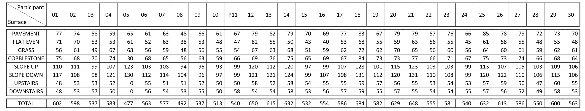
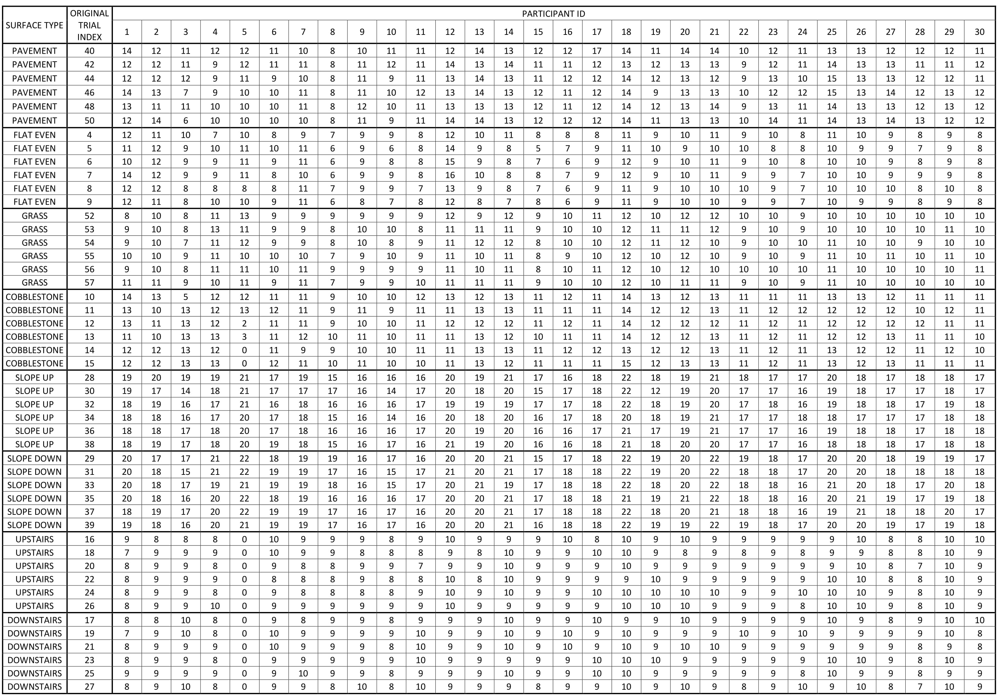

# Description

This repository is linked to the paper by K.Saeed, A. Sawicki: Comparison of orientation invariant inertial gait matching algorithms on different substrate types. 
Mentioned paper uses the data set Luo Y., Coppola S., Dixon P., Li S., Dennerlein J., Hu B.: A database of human gait performance on irregular and uneven surfaces collected by wearable sensors.Sci. Data 2020,7, 2019 , and gait cycles were manually selected.

The purpose of the repository is to provide additional information about the numbers of gait samples in each surface and information about the exact begins of the gait cycle.

# Dataset link

To repeat the experiment, download the original database in its raw form
https://springernature.figshare.com/collections/A_database_of_human_gait_performance_on_irregular_and_uneven_surfaces_collected_by_wearable_sensors/4892463/1